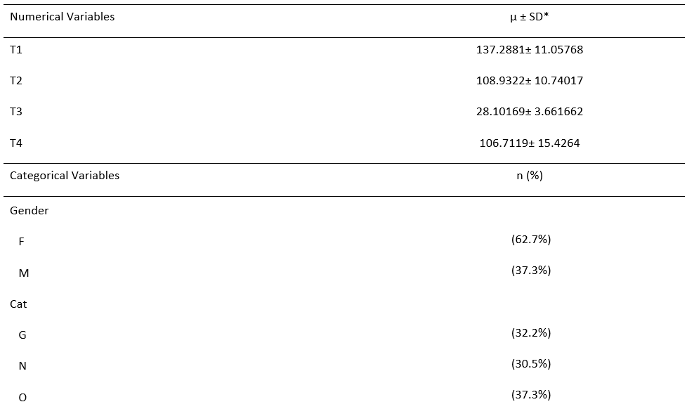

```{r setup, include=FALSE}
knitr::opts_chunk$set(echo = TRUE)

library(png)
library(psych)
```

## Overview:

The dataset *FinalProject* will be used throughout this analytic project. The aim of the project is to generate descriptive statistics and visualizations of the data. In addition to this, the data will be tested for correlation and examined for differences in means.
<br>

```{r}
# Data load
FinalProject <- read.csv("FinalData(2).csv")

attach(FinalProject)
```

### Generating Descriptive and Inferential Statistics

Inspection of the data reveals four numerical variables (**T1:T4**) as well as two categorical variables (**Gender** and **Cat**). The categorical variable, **Gender**, has two possible values (*F* or *M*) while **Cat** has three possible values (*G*, *N*, or *O*). The categorical nature of **Gender** and **Cat** indicates that calculating proportion sizes (%) would be the most appropriate way to provide descriptive statistics about the two variables. Meanwhile, values for mean (M)  and standard error (SE) can be calculated for **T1:T4** since they are numeric variables. Standard error will be the single inferential statistic calculated in this step. A table of the resulting statistics (Table 1) will be generated in Word and embedded into this document.
<br>

```{r}
# Mean and standard Error

MEANT1 <- mean(T1)
SET1 <- sd(T1)/sqrt(length(T1))

MEANT2 <- mean(T2)
SET2 <- sd(T2)/sqrt(length(T2))

MEANT3 <- mean(T3)
SET3 <- sd(T3)/sqrt(length(T3))

MEANT4 <- mean(T4)
SET4 <- sd(T4)/sqrt(length(T4))

# Prob. by Gender

FemaleProb <- 37/59

MaleProb <- 22/59

# Prob. by Cat

GProb <- 19/59

NProb <- 18/59

OProb <-  22/59
```
<br>


Table 1. Descriptive and Inferential Statistics for FinalProject dataset (n = 5495)

```{r out.width="75%", echo = FALSE}
# Embedding Table Created in Word

```

** Note: echo = FALSE used to hide R code chunk used to embed Word table
<br>
<br>

Table 1 displays calculations for mean and standard error for the dataset's numerical values as well as the proportions for each categorical variable group. Examination of mean and standard error values for **T1:T4** reveals that **T1** has the highest mean value (M = 137.2881 +/- 11.05768). Meanwhile, although **T4** (M = 106.7119) has a smaller mean than **T1**, the standard error for the variable (SE = 15.4264) indicates that the population's true mean may overlap with that of T1. This same relationship is also present between **T2** (M = 108.9322 +/- 10.74017) and **T4**. Scatterplots (Figure 1 and Figure 2) will be used to determine if a visual correlation between the variables (**T1** v. **T4** and **T2** v. **T4**) is present.

### Scatterplots

```{r}
# T1 v. T4

plot(T1, T4, xlab = "T1", ylab = "T4", xlim = c(20,420), ylim = c(0,170), main = "T1 vs. T4")

```

Figure 1. Scatterplot for T1 v. T4

<br>

```{r}
# T2 v. T4

plot(T2, T4, xlab = "T2", ylab = "T4", xlim = c(20,220), ylim = c(0,170), main = "T2 vs. T4")
```

Figure 2. Scatterplot for T2 v. T4
<br>
<br>

Inspection of Figure 1 reveals a slight positive correlation between **T1** and **T4**. There also appears to be two possible outliers for **T4** as well as one outlier for **T1**. In contrast, Figure 2 shows a moderate to strong positive correlation between **T2** and **T4** with only one obvious outlier for **T4** and no obvious outliers for **T2**. A matrix (Figure 3) depicting the correlation between variables (represented by Pearson's *r*) as well as each variable's distribution of values will be generated to further inspect the data.
<br>

### Correlation Matrix
```{r}
pairs.panels(FinalProject [3:6])
```

Figure 3. Correlation matrix for variables T1, T2, T3, and T4
<br>
<br>

The correlation matrix in Figure 3 shows a strong to very strong correlation for all pairwise correlations between **T1:T4**. However, the histograms depicting the spread of values across each variable indicate that all four variables are right- or positive-skewed. Next, a simple linear regression using the variables **T1** and **T4** will be attempted.

### Simple Linear Regression (SLR)

```{r}
lm(formula = T1 ~ T4)
```

To conduct a SLR, **T4** is set as the model's independent variable while **T1** will act as the response variable. The correlation coefficient produced for the model is 0.5077, indicating a 0.5077 increase in **T1** for every one-unit increase in **T4**. However, the significance of this correlation cannot be determined as the model does not produce a p-value. For this reason, it can be inferred that linear regression is not the correct model for this data, likely due to the skewed distribution of the data. 

### Two Sample T-Test
```{r}
t.test(T1~Gender, var.equal = TRUE)
```

In this step, a two sample t-test has been conducted to determine whether a difference exists in population means among men (**Gender** = M) and women (**Gender** = F) for **T1**. The hypotheses for this test were:

H0: There is no difference in the mean value for T1 between men and women.

HA: There is a difference in tihe mean value for T1 between men and women.

The t-test for these variables produces a non-significant p-value of 0.3306. For this reason, the null hypothesis cannot be rejected. Therefore, it can be said that there is not enough evidence to conclude that a difference exists between mean **T1** values for men and women.
<br>

### One-Way ANOVA

A one-way ANOVA will be performed to determine whether a difference exists between mean **T1** values for each category of **Cat** (*G*, *N*, and *O*). This is an appropriate test since the means of more than two groups are being compared. The following hypotheses will be tested in this step:

H0: The mean value for T1 is the same among all three categories for Cat.

HA: The mean value for T1 is different between at least two categories of Cat.
<br>

```{r}
## Mean by Cat

by(T1, Cat, mean)

## Standard Deviation by Cat

by(T1, Cat, sd)

```

Calculations for mean **T1** values by **Cat** group reveal a smaller mean value for **Cat** = *G* (M = 87.63158) when compared to the mean values for **Cat** = *N* (M = 181.6667) **Cat** = *O* (M = 143.8636). Calculations for standard deviation also indicate that the mean for **Cat** = *N* has a much larger standard deviation than the other two categories of **Cat**. Therefore, it can be said that there is much more variability in **T1** values for **Cat** = *N*.
<br>
```{r}
one.wayT1 <- aov(T1 ~ Cat, data = FinalProject)
summary(one.wayT1)

```

Results from the one-way ANOVA test show a significant p-value of 0.00201. Therefore, the null hypothesis is rejected, and it can be concluded that enough evidence exists to suggest that mean **T1** values differ between at least two categories of **Cat**. Further pairwise comparison will be performed to determine which **Cat** categories differ in mean **T1**.
<br>
```{r}
pairwise.t.test(T1, Cat, p.adjust.method = "bonferroni")
```

A pairwise comparison of means was conducted by performing a post-hoc Bonferroni test. Results from this test reveals that the difference in mean **T1** values occurs between **Cat** *G* and **CAT** *N* (where *p* = 0.0015).